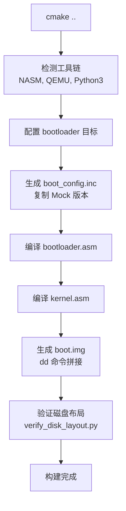

# CCOS 动态内核加载技术参考

本文档详细说明动态内核加载系统和构建流水线涉及的技术细节和数据结构。

---

## 目录
1. [动态配置系统](#1-动态配置系统)
2. [磁盘布局](#2-磁盘布局)
3. [内存映射](#3-内存映射)
4. [CHS 寻址模式](#4-chs-寻址模式)
5. [构建流水线](#5-构建流水线)
6. [验证系统](#6-验证系统)

---

## 1. 动态配置系统

### 1.1 配置文件架构

#### boot_config.inc 结构

```
boot_config.inc
├── 磁盘位置配置
│   ├── KERNEL_LBA_START          - 内核起始 LBA
│   ├── KERNEL_SECTOR_COUNT       - 内核扇区数（动态计算）
│   └── KERNEL_CHS_*              - CHS 参数（C/H/S）
├── 内存布局配置
│   ├── KERNEL_LOAD_SEGMENT       - 加载段地址
│   └── KERNEL_LOAD_OFFSET        - 加载偏移地址
└── 几何参数
    ├── SECTORS_PER_TRACK         - 每磁道扇区数
    └── HEADS                     - 磁头数
```

#### 配置生成流程


### 1.2 配置宏定义

#### 内核磁盘位置

```asm
; LBA 寻址（线性块寻址）
%define KERNEL_LBA_START          4       ; 从扇区 4 开始（1-based）
%define KERNEL_SECTOR_COUNT       1       ; 扇区数（将被替换为实际值）

; CHS 寻址（柱面-磁头-扇区）
%define KERNEL_CHS_CYLINDER       0       ; 柱面号
%define KERNEL_CHS_HEAD           0       ; 磁头号
%define KERNEL_CHS_SECTOR         5       ; 扇区号（1-based，从 5 开始）
```

#### 内存加载地址

```asm
; 段:偏移 = 0x1000:0x0000 = 物理地址 0x10000
%define KERNEL_LOAD_SEGMENT       0x1000
%define KERNEL_LOAD_OFFSET        0x0000
```

#### 最大限制

```asm
; 64MB = 65536 KB = 131,072 扇区
%define KERNEL_MAX_SECTORS        131072
```

---

## 2. 磁盘布局

### 2.1 磁盘映像结构

```
扇区布局（LBA 方式）:
┌─────────────┬──────────┬──────────────────────────────┐
│    LBA      │  扇区    │           内容               │
├─────────────┼──────────┼──────────────────────────────┤
│     0       │    1     │ bootloader.bin (Stage 1)     │
│     1       │    2     │ bootloader.bin (Stage 2)     │
│     2       │    3     │ bootloader.bin (Stage 2)     │
│     3       │    4     │ kernel.bin (起始)            │
│     4       │    5     │ kernel.bin                   │
│    ...      │   ...    │ ...                          │
│  3+N        │   4+N    │ kernel.bin (结束)            │
└─────────────┴──────────┴──────────────────────────────┘
```

### 2.2 Bootloader 大小计算

```python
# Python 伪代码
bootloader_size = os.path.getsize('bootloader.bin')
bootloader_sectors = (bootloader_size + 511) // 512  # 向上取整

# 当前: bootloader.bin ≈ 1400 字节 = 3 扇区
BOOTLOADER_SECTORS = 3
```

### 2.3 内核起始位置

```
内核 LBA 起始 = bootloader 占用扇区数
               = 3 (Stage1=1, Stage2=2)
               = LBA 3 (0-based)
               = 扇区 4 (1-based)
```

### 2.4 CHS 地址转换

#### LBA 到 CHS 公式

```
给定标准几何参数:
  - SPT (Sectors Per Track) = 63
  - HPC (Heads Per Cylinder) = 16

LBA = 3 (扇区 4，0-based)

计算:
  Cylinder = LBA / (SPT × HPC)
          = 3 / (63 × 16)
          = 3 / 1008
          = 0

  Head     = (LBA / SPT) % HPC
          = (3 / 63) % 16
          = 0 % 16
          = 0

  Sector   = (LBA % SPT) + 1     # 1-based
          = (3 % 63) + 1
          = 3 + 1
          = 5

结果: CHS = (0, 0, 5)
```

#### CHS 到 LBA 公式

```
LBA = (Cylinder × HPC + Head) × SPT + (Sector - 1)

示例: CHS = (0, 0, 5)
LBA = (0 × 16 + 0) × 63 + (5 - 1)
   = 0 + 4
   = 3 (扇区 4 的 0-based LBA)
```

---

## 3. 内存映射

### 3.1 低内存布局

```
地址范围             大小        内容
────────────────────────────────────────────────
0x00000 - 0x003FF   1 KB        IVT (中断向量表)
0x00400 - 0x004FF   256 B       BDA (BIOS 数据区)
0x00500 - 0x07BFF   ~29 KB      可用内存
0x07C00 - 0x07DFF   512 B       Stage 1 (MBR)
0x07E00 - 0x083FF   1536 B      Stage 2 (Bootloader 主体)
0x08400 - 0x0FFFF   ~30 KB      内存间隙
0x10000 - 0x1FFFF   64 KB       内核加载区（最大 64MB）
...
0x10000 + N         动态        内核结束地址
```

### 3.2 内存隔离保证

```
Stage 2 结束地址计算:
  起始: 0x7E00
  大小: BOOTLOADER_SECTORS × 512
       = 3 × 512
       = 1536 字节
  结束: 0x7E00 + 1536 = 0x8400

内核起始地址:
  0x10000

隔离间隙:
  0x10000 - 0x8400 = 30,720 字节 = 60 扇区
```

### 3.3 寄存器设置

#### 实模式内核加载

```asm
; 设置 ES:BX = 0x1000:0x0000 = 物理地址 0x10000
mov ax, KERNEL_LOAD_SEGMENT   ; AX = 0x1000
mov es, ax                     ; ES = 0x1000
mov bx, KERNEL_LOAD_OFFSET    ; BX = 0x0000

; 物理地址 = ES × 16 + BX
;           = 0x1000 × 16 + 0x0000
;           = 0x10000
```

---

## 4. CHS 寻址模式

### 4.1 BIOS INT 13h AH=02h

#### 寄存器参数

```asm
mov ah, 0x02                ; 功能号：读扇区
mov al, KERNEL_SECTOR_COUNT ; 要读取的扇区数 (1-127)
mov ch, KERNEL_CHS_CYLINDER ; 柱面号 (0-1023)
mov cl, KERNEL_CHS_SECTOR   ; 扇区号 (1-63, 注意是 1-based)
mov dh, KERNEL_CHS_HEAD     ; 磁头号 (0-15)
mov dl, 0x80                ; 驱动器号 (0x80 = 第一硬盘)
int 0x13                    ; 调用 BIOS
```

#### 返回值

```
CF = 0  : 成功，AL = 实际读取的扇区数
CF = 1  : 失败，AH = 错误代码
```

### 4.2 错误代码

```
AH = 01h : 无效命令
AH = 02h : 地址标记未找到
AH = 04h : 扇区未找到
AH = 0Ch : 无效介质
AH = 0Dh : 扇区数无效
```

### 4.3 扇区数限制

```
BIOS INT 13h AH=02h 限制:
  - 最大单次读取: 127 扇区
  - 超过需要分批读取

当前实现:
  - 只支持 <= 127 扇区的内核
  - 更大内核需要实现多批读取循环
```

### 4.4 load_kernel_chs 函数

```asm
; load_kernel_chs - 使用 CHS 寻址加载内核
; 输入: 无（使用 boot_config.inc 定义的宏）
; 输出: 内核加载到 KERNEL_LOAD_SEGMENT:KERNEL_LOAD_OFFSET
; 返回: CF=0 成功, CF=1 失败
bits 16
load_kernel_chs:
    pusha

    ; 设置目标地址
    mov ax, KERNEL_LOAD_SEGMENT
    mov es, ax
    mov bx, KERNEL_LOAD_OFFSET

    ; 检查内核大小（必须 <= 127 扇区）
    mov ax, KERNEL_SECTOR_COUNT
    cmp ax, 127
    ja .kernel_too_large       ; 如果超过，跳转到错误处理

    ; BIOS 磁盘读参数
    mov ah, 0x02                    ; 读功能
    mov al, KERNEL_SECTOR_COUNT     ; 扇区数
    mov ch, KERNEL_CHS_CYLINDER     ; 柱面
    mov cl, KERNEL_CHS_SECTOR       ; 扇区（1-based）
    mov dh, KERNEL_CHS_HEAD         ; 磁头
    mov dl, 0x80                    ; 第一硬盘

    ; 执行读取
    int 0x13

    ; 错误检查
    jc .read_error

    ; 验证读取的扇区数
    cmp al, KERNEL_SECTOR_COUNT
    jne .read_mismatch

    popa
    clc                         ; 清除进位标志 = 成功
    ret

.kernel_too_large:
    mov si, msg_kernel_too_large
    call print_bios

.read_error:
.read_mismatch:
    popa
    stc                         ; 设置进位标志 = 错误
    ret
```

---

## 5. 构建流水线

### 5.1 CMake 构建流程



### 5.2 boot/CMakeLists.txt 关键配置

```cmake
# Bootloader 大小（首次构建后确定）
set(BOOTLOADER_SECTORS 3 CACHE STRING "Number of sectors bootloader occupies")

# 生成 boot_config.inc
add_custom_command(
    OUTPUT ${CMAKE_CURRENT_BINARY_DIR}/boot_config.inc
    COMMAND ${CMAKE_COMMAND} -E echo "Generating boot_config.inc..."
    # 首次构建使用 Mock 配置
    COMMAND ${CMAKE_COMMAND} -E copy_if_different
        ${CMAKE_CURRENT_SOURCE_DIR}/boot_config.inc
        ${CMAKE_CURRENT_BINARY_DIR}/boot_config.inc
    COMMENT "Generating initial boot configuration"
    VERBATIM
)

# 编译 bootloader（依赖配置文件）
add_custom_command(
    OUTPUT ${CMAKE_BINARY_DIR}/bootloader.bin
    COMMAND ${NASM} -f bin
        -I${CMAKE_CURRENT_BINARY_DIR}/
        ${CMAKE_CURRENT_SOURCE_DIR}/bootloader.asm
        -o ${CMAKE_BINARY_DIR}/bootloader.bin
    DEPENDS
        ${CMAKE_CURRENT_SOURCE_DIR}/bootloader.asm
        ${CMAKE_CURRENT_BINARY_DIR}/boot_config.inc
    COMMENT "Building bootloader (with dynamic configuration)"
    VERBATIM
)
```

### 5.3 根 CMakeLists.txt 验证集成

```cmake
# 构建后验证
add_custom_command(TARGET boot_img POST_BUILD
    COMMAND ${PYTHON} ${CMAKE_SOURCE_DIR}/scripts/verify_disk_layout.py
        ${CMAKE_BINARY_DIR}/bootloader.bin
        ${CMAKE_BINARY_DIR}/kernel.bin
    COMMENT "Verifying disk layout..."
)
```

### 5.4 GenerateKernelSize.cmake 工作原理

```cmake
# 1. 获取内核文件大小
file(SIZE "${KERNEL_BIN}" KERNEL_SIZE_BYTES)

# 2. 计算扇区数（向上取整）
math(EXPR KERNEL_SECTORS "(${KERNEL_SIZE_BYTES} + 511) / 512")

# 3. 验证不超过最大值
set(MAX_SECTORS 131072)  # 64MB
if(KERNEL_SECTORS GREATER MAX_SECTORS)
    message(FATAL_ERROR "Kernel too large")
endif()

# 4. 计算 CHS 参数
math(EXPR CHS_CYLINDER "${KERNEL_LBA_ZERO} / (63 * 16)")
math(EXPR CHS_HEAD "(${KERNEL_LBA_ZERO} / 63) % 16")
math(EXPR CHS_SECTOR "(${KERNEL_LBA_ZERO} % 63) + 1")

# 5. 生成 .inc 文件
file(WRITE "${OUTPUT_FILE}" "...配置内容...")
```

---

## 6. 验证系统

### 6.1 verify_disk_layout.py 功能

```python
#!/usr/bin/env python3
"""
CCOS 磁盘布局验证脚本

功能:
1. 检查 MBR 签名 (0xAA55)
2. 计算 bootloader 和内核大小
3. 验证内存布局无重叠
4. 验证磁盘布局连续
5. 检查内核魔数
6. 验证内核大小限制
"""
```

### 6.2 验证输出示例

```
CCOS Disk Layout Verification
============================================================

Analyzing bootloader...
  Size: 1398 bytes (3 sectors)
  Has MBR: True
  Valid MBR signature

Analyzing kernel...
  Size: 512 bytes (1 sectors, 0.00 MB)

============================================================
DISK LAYOUT (LBA)
============================================================
Bootloader:  Sector 1-3 (LBA 0-2)
Kernel:      Sector 4-4 (LBA 3-3)

============================================================
MEMORY LAYOUT
============================================================
Stage 1:     0x7C00 - 0x7E00
Stage 2:     0x7E00 - 0x8400
Kernel:      0x10000 - 0x10200

Stage 2 size: 1536 bytes (3 sectors)
Memory gap:  30720 bytes (60 sectors)

============================================================
KERNEL MAGIC NUMBERS
============================================================
  First dword: 0x90EB9000
  ✓ Appears to be x86-64 code (REX prefix found)

============================================================
✓ PASSED: Layout is valid
```

### 6.3 内存重叠检测

```python
def calculate_memory_layout(bootloader_sectors, kernel_sectors):
    stage2_end = 0x7E00 + (bootloader_sectors * 512)
    kernel_start = 0x10000

    # 检查重叠
    if stage2_end > kernel_start:
        return "ERROR: Memory overlap detected"

    # 检查间隙
    gap = kernel_start - stage2_end
    if gap < 512:
        return f"WARNING: Small memory gap ({gap} bytes)"

    return "OK"
```

---

## 7. 数据结构

### 7.1 boot_config.inc 完整结构

```asm
; ==============================================================================
; CCOS Bootloader Configuration
; ==============================================================================
; This file is AUTO-GENERATED by CMake during build
; DO NOT EDIT MANUALLY - Changes will be overwritten
; ==============================================================================

; Kernel disk location (LBA/CHS)
%define KERNEL_LBA_START          4           ; Kernel starts at sector 4 (1-based)
%define KERNEL_SECTOR_COUNT       1           ; TODO: Will be replaced by actual size

; Memory layout (ensure 1-sector gap from Stage 2)
%define KERNEL_LOAD_SEGMENT       0x1000      ; ES:BX = 0x1000:0x0000 = 0x10000
%define KERNEL_LOAD_OFFSET        0x0000

; Bootloader size info
%define BOOTLOADER_SECTORS        3           ; Stage1(1) + Stage2(2)

; Memory gap: 1 sector between bootloader and kernel
; Stage 2 ends at:  0x7E00 + (3 sectors * 512) = 0x7E00 + 0x600 = 0x8400
; Kernel starts at: 0x10000 (safe gap of ~30KB)

; Maximum kernel size: 64MB = 131072 sectors
%define KERNEL_MAX_SECTORS        131072

; ============================================================================
; CHS Geometry Calculation (for CHS fallback)
; ============================================================================
; Assumes standard geometry: 63 sectors/track, 16 heads, X cylinders
; LBA to CHS formula:
;   Cylinder = LBA / (sectors_per_track * heads)
;   Head     = (LBA / sectors_per_track) % heads
;   Sector   = (LBA % sectors_per_track) + 1

%define SECTORS_PER_TRACK         63
%define HEADS                     16

; Kernel CHS start (LBA=4)
; Cylinder = 4 / (63 * 16) = 0
; Head     = (4 / 63) % 16 = 0
; Sector   = (4 % 63) + 1 = 5
%define KERNEL_CHS_CYLINDER       0
%define KERNEL_CHS_HEAD           0
%define KERNEL_CHS_SECTOR         5
```

---

## 8. 常见计算

### 8.1 文件大小到扇区数

```python
def bytes_to_sectors(byte_size):
    """将字节数转换为扇区数（向上取整）"""
    return (byte_size + 511) // 512

# 示例
bytes_to_sectors(500)    # = 1 扇区
bytes_to_sectors(512)    # = 1 扇区
bytes_to_sectors(513)    # = 2 扇区
bytes_to_sectors(1400)   # = 3 扇区
bytes_to_sectors(65536)  # = 128 扇区
```

### 8.2 LBA 到物理地址计算

```python
def lba_to_byte(lba):
    """LBA 转换为字节偏移"""
    return lba * 512

# 示例
lba_to_byte(0)  # = 0      (bootloader 开始)
lba_to_byte(3)  # = 1536   (kernel 开始)
lba_to_byte(4)  # = 2048   (kernel 第二扇区)
```

### 8.3 段:偏移到物理地址

```python
def segment_offset_to_physical(segment, offset):
    """段:偏移转换为物理地址"""
    return (segment * 16) + offset

# 示例
segment_offset_to_physical(0x07C0, 0x0000)  # = 0x7C00 (Stage 1)
segment_offset_to_physical(0x07E0, 0x0000)  # = 0x7E00 (Stage 2)
segment_offset_to_physical(0x1000, 0x0000)  # = 0x10000 (Kernel)
```

---

**更新日期**: 2026-02-15
**作者**: Claude Code + User
**许可证**: MIT License（可自由分享和修改）
